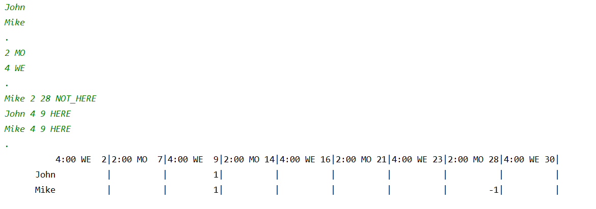

# Основы Java - день №0
### Управление массивами и структурами данных

# Содержание
1. [Упражнение 00 - Сумма цифр](#упражнение-00---сумма-цифр)
2. [Упражнение 01 – Простое число](#упражнение-01--простое-число)
3. [Упражнение 02 – Поток входных данных](#упражнение-02--поток-входных-данных)
4. [Упражнение 03 – Визуализация данных](#упражнение-03--визуализация-данных)
5. [Упражнение 04 – Частотный анализ](#упражнение-04--частотный-анализ)
6. [Упражнение 05 – Расписание](#упражнение-05--расписание)

### Основные правила
- Использовать версию Java 1.8.
- Соблюдать форматирование кода, основываясь на стандартах Oracle.
- Использовать "System.out" для вывода.

###  Правила для
- Задачи оформлять в отдельные каталоги 'ex**00**, ex**01**, ...', подставляя номер задачи. Решение оформлять в файле 'Program.java'
- Пользовательские классы и методы запрещены, за исключением статичных функций в классе main.
- System::exit можно использовать для всех задач.
- Результат работы задач должен соответствовать приложенным примерам ввода/вывода. Стрелка '->' в примерах указанна только для наглядности.
  
 \*Некоторые задачи из-за ограничений могут потребовать нетривиального решения.

### Упражнение 00 - Сумма цифр
**Разрешено:**
 - System.out
 - примитивные типы данных и операции над ними

Нужно посчитать сумму цифр целого 6-значного числа.\
Входное число должно быть прописано прямо в исходном коде


Пример вывода для числа 479598:
```
$ java Program
  42
```

### Упражнение 01 – Простое число
**Разрешено:**
- System.out, System.err, Scanner(System.in)
- Примитивные типы данных и операции над ними
- Условные операторы
- Циклы

Используя доступные операторы, проверьте является ли введенное число простым (не имеет делителей кроме 1 и самого себя).\
Входные числа вводит пользователь во время работы программы.\
Дополнительно выводится количество шагов, затраченных на проверку числа.\
В этой задаче итерация — это одна операция сравнения.

При вводе 1 или меньшего числа, выводить сообщение `IllegalArgument` и выходить с кодом `-1`.


Пример работы программы:

```
$ java Program
-> 169
   false 12

$ java Program
-> 113
   true 10

$ java Program
-> 42
   false 1

$ java Program
-> -100 
   Illegal Argument
```

### Упражнение 02 – Поток входных данных
**Разрешено:**
- System.out, System.err, Scanner(System.in)
- Примитивные типы данных и операции над ними
- Условные операторы
- Циклы

Представим себя в команде разработчиков поисковой системы.

Нужно подсчитать количество запросов связанных с приготовлением кофе. Запросы идет бесконечно, и мы не можем сохранить все запросы для последующей обработки.\
Но можно обрабатывать запросы в потоке. Предположим, что каждый запрос представляет собой натуральное число, отличное от 0 и 1. Запрос относится к приготовлению кофе только в том случае, если сумма цифр числа (запроса) является простым числом.

Наша программа программа должна определять запросы связанные с приготовлением кофе, и подсчитывать количество таких запросов.

Для простоты, обрабатывать будем конечную последовательность чисел. Число `42` будет сигналом к завершению ввода. Так же положим, что вводимые числа являются абсолютно корректными.

Пример работы программы:

```
$ java Program
-> 198131
-> 12901212
-> 11122
-> 42
   Count of coffee-request – 2
```


### Упражнение 03 – Визуализация данных
**Разрешено:**
- System.out, System.err, Scanner(System.in)
- Примитивные типы данных и операции над ними
- Условные операторы
- Циклы
- String, String::equals

Поработаем аналитиками данных.\
Аналитика данных распространенная задача, но глазами удобнее воспринимать её визуализацию.\
Данная программа должна визуализировать прогресс студентов за несколько учебных недель.\
Прогресс за неделю оценивается по минимальной оценке за 5 тестов. Оценки выставляются по шкале от 1 до 9.

Максимальное количество недель для анализа 18. После ввода всей информации, выводится график с еженедельным прогрессом (по величине величине минимальной оценки).\
Можно ввести `42` для завершения ввода.

Не гарантируется порядок ввода недель, например могут ввести сначала 2 неделю, потом первую. В подобных случаях следует выдать ошибку с текстом `IllegalArgument` и завершить программу с кодом `-1`.

**Примечания:**
1. Есть множество способов хранения информации. Нужно обойтись без массивов.
2. Частая конкатенация строк особенно в циклах может замедлять приложение. Нужно обойтись без конкатенация строк для формирования результата.

Пример работы программы:

```
$ java Program
-> Week 1
-> 4 5 2 4 2
-> Week 2
-> 7 7 7 7 6
-> Week 3
-> 4 3 4 9 8
-> Week 4
-> 9 9 4 6 7
-> 42
Week 1 ==>
Week 2 ======>
Week 3 ===>
Week 4 ====>
```

### Упражнение 04 – Частотный анализ
**Разрешено:**
- System.out, System.err, Scanner(System.in)
- Примитивные типы данных и операции над ними
- Массивы
- Условные операторы
- Циклы
- String, String::equals, String::toCharArray, String::length

Для расшифровки плохо зашифрованного текста можно использовать частотный анализ 
([Frequency_analysis](https://en.wikipedia.org/wiki/Frequency_analysis)).\
В роли хакеров напишем программу которая подсчитывает частоту появления символов в тексте. 

Люди легче воспринимают визуализацию данных. В этом задании выведем гистограмму топ 10 символов по частоте появления в порядке убывания.

Если символы появляются одинаково, место в топе присваивается в лексикографическом порядке.\
Данные поступают на вход в виде 1 строки с "\n" на конце.\
Высота отображаемых столбцов должна скалироваться от 0 до 10 ячеек.

Подразумевается, что каждый введенный символ помещается в `char` (Unicode BMP; например "S" имеет код 53, а максимальная величина кода символа 65535)

Максимальная длина введенной строки 999 символов.

**Примечание:** задача должна решатся без многократных проходов по введенной строке (например сортировка и удаление повторений), потому что это существенно влияет на производительность программы. Нужно использовать другой подход к обработке информации.  

Пример работы программы:

```
$ java Program

-> AAAAAAAAAAAAAAAAAAAAAAAAAAAAAAAAASSSSSSSSSSSSSSSSSSSSSSSSDDDDDDDDDDDDDDDDDDDDDDDDDDDDDDDDDWEWWKFKKDKKDSKAKLSLDKSKALLLLLLLLLLRTRTETWTWWWWWWWWWWOOOOOOO42

 36
  #  35
  #   #
  #   #  27
  #   #   #
  #   #   #
  #   #   #
  #   #   #  14  12
  #   #   #   #   #   9
  #   #   #   #   #   #   7   4
  #   #   #   #   #   #   #   #   2   2
  D   A   S   W   L   K   O   T   E   R
```

### Упражнение 05 – Расписание
**Разрешено:**
- System.out, System.err, Scanner(System.in)
- Примитивные типы данных и операции над ними
- Массивы
- Условные операторы
- Циклы
- String, String::equals, String::toCharArray, String::length

На этот раз нужна программа для ведения расписания.\
Заказчик открыл школу в сентябре 2020 года. Нужно написать MVP версию программы для этого месяца.

Требуется возможность создать список студентов и присвоить время, день недели занятий.\
Занятия могут проводится в любой день недели с 13:00 до 18:00. В один день может проводиться несколько занятий. Но не более 10 занятий в неделю.\
Максимальное количество учеников равно 10. Максимальная длина имени ученика 10 (не содержит пробелы).

Так же необходима возможность проставлять посещаемость. Для этого прописывается имя студента, время, дата, статус посещения (HERE, NOT_HERE). Нет необходимости прописывать посещение всех занятий за месяц (запись о посещении может быть пустой).

Программа должна работать по следующему алгоритму:
1. Создание списка учеников.
2. Указание занятий (время, день недели).
3. Проставление посещений.
4. Вывод табличной формы с посещениями. 

Операции разделяются символом "." (точка). Гарантируется абсолютная корректность введенных данных, за исключением порядка последовательности введенных занятий (время, дата)  

Пример работы программы:


